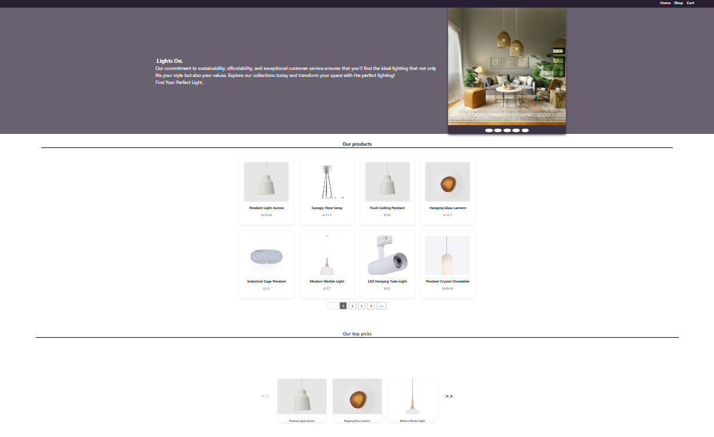
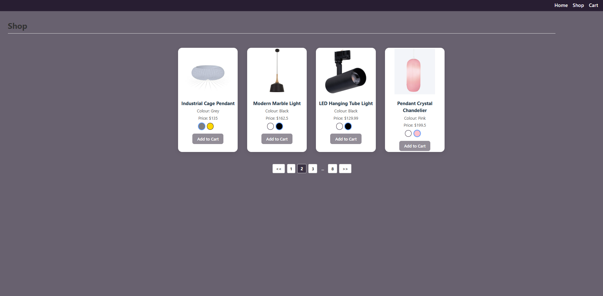
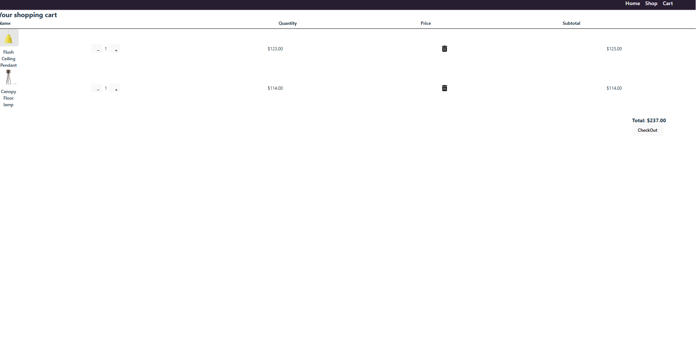

# E-Commerce App for lighting products

A responsive and user-friendly e-commerce application built with **React + TypeScript**, powered by **Cloudinary** for image management and **Firestore** for backend data storage.

Live site: https://janitech2025.github.io/eShop/

---

## Features

- Home page displays paginated product images and lifestyle images & featured products in carousel displays
- Shop page displays products details along with variant selections and an add to cart button
- Cart page displays products added to the cart or empty page if there is no selection
- Displays **product variants** based on selected **colour**
- Uses **FontAwesome icons** for enhanced UI
- **Carousel** for:
  - Lifestyle images
  - Featured products on homepage
- Adds to cart only if the product:
  - Is within **stock limits**

---

## Tech Stack

[](https://reactjs.org/)
[](https://www.typescriptlang.org/)
[](https://cloudinary.com/)
[](https://firebase.google.com/docs/firestore)

---

## Screenshots

### Homepage



### Product Details + Variants



### Cart Functionality



## Learnings

- I learnt how to use useContext as a single source of truth to manage global state for both the product list and the cart.

- I got comfortable working with React Router to handle browser navigation and dynamic routes.

- Using fallback values in components to keep the UI stable, especially when data might be undefined or loading.

- Using pagination to break up and display fetched search results effectively.

---

## Future Improvements

Add login and manage user profiles

Add Admin and panel for managing products

Search and filter functionality

Add payment

````

---

## Deployment Instructions

### Build the App

```bash
npm run build

````
